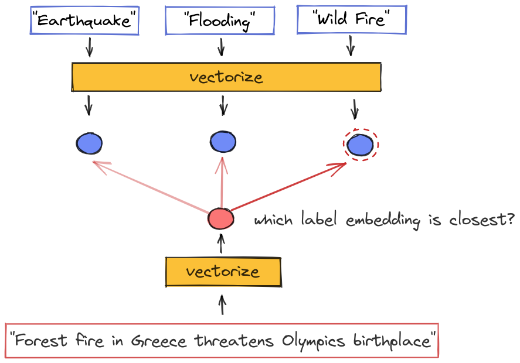

# Blog: Zero-Shot Event Classification

#### Why we care about event classification

We often think of news as a time-series of discrete events. For example, we might visualize yesterday’s top news events like this:

(visualize timeline of discrete events)

But often, we are really only interested in certain _kinds_ of events. In other words, in my feed, I only want to see events meeting certain criteria.

We call the task of labeling each event in a stream with its type **event classification**.

#### What we did about it

Since we’re sciency types, of course we want to use a machine learning model to do this. And since we’re engineers we want the model we use to be fast, cheap, and scalable. So we’re going to constrain ourselves to the simplest type of model, but we’re going to be clever about how we set things up.

**The task**

Luckily there’s a shared task for that, the CASE fine-grained event classification shared task.

**Zero-shot classification**

We submitted several systems to the CASE shared task to get an idea how our models stack up in an unbiased evaluation setting. After that we did some more experiments to explore how to make our models even better, while still maintaining the efficient

What the results were:

#### What you can do with our work:

Start building a zero-shot classifier by writing down descriptions of events you’re interested in
Apply our system to classify news with your labels
