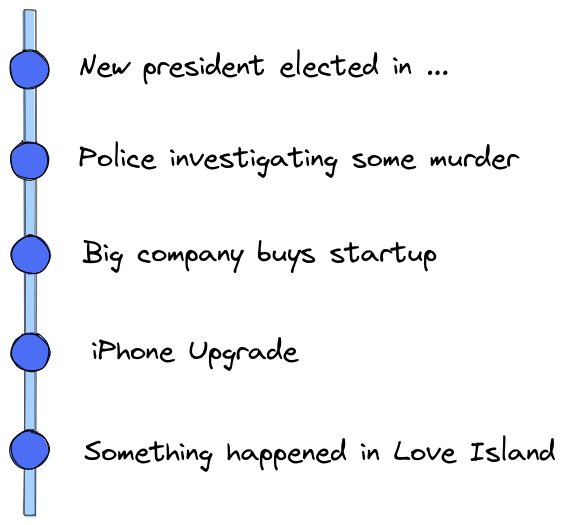
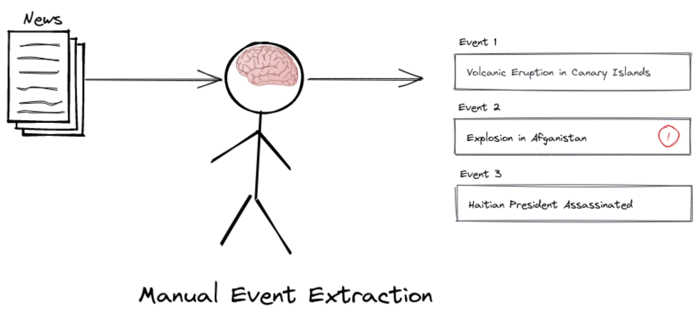
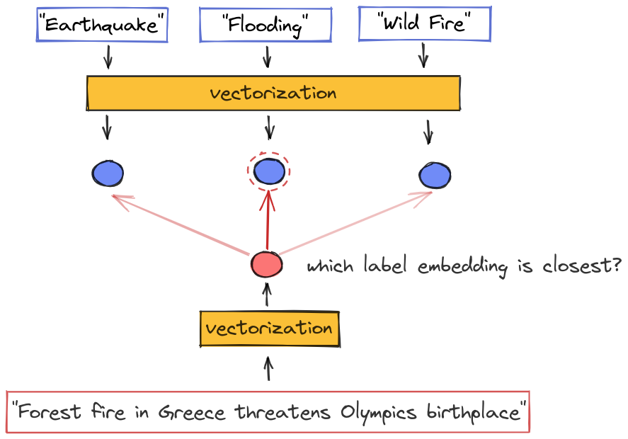

# Blog: Zero-Shot Event Classification for Newsfeeds

By Chris Hokamp and Demian Gholipour Ghalandari

#### TLDR
* we share a simple, effective and scalable approach for bootstrapping zero-shot text classification models
* we give an overview of zero-shot learning for fine-grained event classification and the CASE 2021 shared task
* we provide jupyter notebooks with code and examples

#### What you can do with this work

* Start building a zero-shot classifier by writing down descriptions of events you’re interested in
* Apply our system to classify news with your custom labels

In this post, we'll go over an approach to zero-shot event classification that worked well at 
the [CASE 2021 fine grained event detection shared task](https://emw.ku.edu.tr/case-2021/). Code and examples are available
in [our project repository](https://github.com/AYLIEN/fine-grained-event-classification). 

Although several similar approches have been blogged about elsewhere, we claim that [this notebook](../notebooks/SentenceTransformers-ZeroShot-Baseline.ipynb) is the current fastest way to get a zero-shot text classifier running on a local machine. 

----------------- 
### The News as a Stream of Events

We intuitively think of news as a time-series of discrete events. 
For example, we might visualize yesterday’s top news events like this:

<p align="center">
  
</p>

However, raw streams of news events, such as the RSS feeds of major news publishers, are very noisy. 
Humans are good at contextualizing information and understanding what is useful, but we aren't good at 
processing high volumes of content, and we don't scale well. Therefore, we would like to build automatic ways 
to filter a raw stream of news into a feed which only contain events that are (1) relevant and (2) novel 
for a given user. This post focuses on (1): classifying news events as relevant / not relevant to specific topics. 

<p align="center">
  
</p>

### Event Classification

In our event filtering system, we'll use machine learning models to categorize content, and let users both **define** and **subscribe** to labels of interest. 

This is similiar to following particular topics on sites such as Google News, with the important distinction that we do not want to miss *any* events of a certain type. In other words, we are not building a precision-focused recommender system to drive user interactions, we are building an event monitoring system for _**filtering**_ news content, and both precision and recall are important.

[//]: # (TODO: note that recommender systems intuitively go for precision and usually don't worry about recall)

#### Detecting Event Types

To build our news event monitoring system, we will need a way of classifying news events according to their type. 
We can approach this as a standard text-classification task, but with an interesting twist: we may not know the types of events up-front. 
In other words, we want to design a pipeline that supports the addition of new labels on-the-fly.

In another twist: we may not have _**any**_ training data at all for the classes we want to detect. We might just have 
a class label, and possibly a short snippet of text describing the label. 

And finally, our news stream is _**really**_ big: we're looking for solutions that scale to millions of articles per day, 
while easily handling hundreds or thousands of distinct labels, each of which may have a very different expected volume 
per day. 

Amazingly, it is actually possible to build a simple baseline system that satisfies these requirements.
It won't outperform usecase-specific systems that use more powerful models and well-tuned hyperparameters along 
with substantial in-domain training data, but it will serve as a good baseline for any explorations in text classification, 
especially for usecases where scalable support for zero-shot classification is an essential requirement. And we can get it up 
and running in less than five minutes(!). 

### The Zero-Shot Classification Setup

Zero-shot classification tasks are characterized by the lack of any labeled examples for the classes of interest. 
Instead, each class is usually represented through meta-information about the class itself, e.g. a short textual class 
description in the case of text classification. 
We are interested in this setup because it simplifies the baseline event classification workflow a lot: 
if a user comes to us with a new event type, we want to be able to immediately start serving them news events of 
that class without needing to annotate a new labelled dataset or go through a complicated re-training/tuning stage. 

Since we’re data-sciency types, obviously we want to use cool machine learning models.
And since we’re engineers we want the model we use to be fast, cheap, and scalable. 
So in order to build our baseline system, we’re going to constrain ourselves to the simplest type of model, 
but we’re going to be clever about how we set things up.

### Key Ingredients

With the requirements set out in the previous sections in mind, let's get specific. We're going to build a nearest-neighbor based 
zero-shot classifier, and treat this problem as semantic search, where the queries are text snippets, and the candidate items in 
the index are labels. 

We'll need:
- a good vectorizer for snippets of news text and label descriptions
- an index for looking up the most similar items to a query

### Zero-Shot Classification with Semantic Search

The core idea of many zero-shot text classification methods is to **compare** a text snippet to a label description. For example, given a label description such as "food recall", we want to compare text snippets to this label and identify relevant matches such as "Tesco recalls major chocolate brand products".

In a nutshell, we wish to have a classifier that can solve this problem:
```
Input: snippets of text
Output: snippets labeled according to a taxonomy of event types
No training data
High Throughput
```

Transformers are the current state-of-the-art for almost all NLP tasks because of the availability of high-quality pre-trained models, 
and because of the flexiblity and effectiveness of the architecture for transfer learning. 

Recent transformer-based models for zero-shot classification are basically of two types:
1) **bi-encoders** encode the input and each of the labels separately
2) **cross-encoders** encode the input and each label together

This diagram from the [Sentence Transformers documentation](https://www.sbert.net/examples/applications/cross-encoder/README.html#when-to-use-cross-bi-encoders) visualizes the difference:

<p align="center">
  
</p>

Cross-encoders usually perform better on zero-shot tasks, but they are _much_ more expensive at runtime, 
because they require us to run the model once for each possible (input, label) pair. For usecases with more than a few labels, 
this approach will not scale, and for usecases with thousands of labels, it is completely intractable. Bi-encoders encode each 
label into a fixed representation that does not depend upon the input, but they are much more efficient at runtime. 

Some recently published zero-shot models use cross-encoders pre-trained on the NLI task. Although these models perform well,
they do not meet our scalability requirements, because a cross-encoder would require passing every possible combination of snippet + candidate-label. 
through the model. 

Instead, we will encode text snippets and label descriptions separately into embeddings of the same vector space using a bi-encoder. We will measure the cosine similarity between the embedding of a snippet and each candidate label. In standard classification tasks, we decide which label to output by simply picking the label with the closest embedding. 

A powerful general-purpose text vectorizer is a crucial requirement for our system. We must carefully chose the model we use to vectorize snippets, because performance of our classifier completely relies on its effectiveness. After significant experimentation, we settled on model from the [sentence-transformers](https://www.sbert.net/) library to vectorize text snippets and labels.

Our approach can be summarized as follows:
1) Encode label description and store the resulting label embeddings in the search index
2) Classify a incoming text snippets:
  - encode snippet
  - measure cosine between snippet embbedding and label embeddings
  - pick label with closest embedding

If we have hundreds or thousands of labels, even just measuring the cosine to every single label can also be become expensive - however, 
there is a simple fix for the case where our label space becomes very large: we can use *approximate nearest-neighbor search* to find the closest label(s). 

The approach naturally supports dynamic labels and zero-shot classification: we can simply add or remove labels and their embeddings from our storage as needed.

Here is a diagram of this framework:

<p align="center">
  </div>
<p>
  
### The CASE 2021 Fine-Grained Event Classification Shared Task

To test our system, we'll focus on a specific text-classification task: zero-shot fine-grained event classification. 
We participated in Task 2 of the CASE 2021 shared task: Fine-Grained Event Classification.
Shared tasks are a great way to test and share ideas in a fair and open setting, 
and to get fast feedback about how different approaches stack up. Many thanks to the organizers of the CASE 2021 
shared task for all of the hard work they did.  

The CASE fine-grained event classification shared task is an ideal challenge for testing zero-shot text classification models. 
The task is to classify short text snippets that report socio-political events into fine-grained event types. 
These types are based on the Armed Conflict Location & Event Data Project (ACLED) event taxonomy, 
which contains 25 detailed event types, such as “Peaceful protest”, “Protest with intervention”, or “Diplomatic event”.
  
We submitted several systems to the CASE 2021 shared task to get an idea how our models stack up in an unbiased evaluation setting. 
The model described above worked best, and in the second phase of the shared task this simple approach acheived the best results on the zero-shot labels 
  (weighted F1 to .445 for the 5 new labels), outperforming much heavier pairwise NLI based systems.


**Results**
  
The CASE shared task organizers picked 5 event types for zero-shot experiments. All submitted systems had to classify examples of these types without having seen training examples of these. Our best system produced the following average evaluation scores over these labels:

|          | Precision | Recall | F1-Score |
|----------|-----------|--------|-----------|
| **micro**    | 0.840     | 0.358  | 0.502     |
| **macro**    | 0.914     | 0.383  | 0.477     |
| **weighted** | 0.920     | 0.358  | 0.443     |

Based on the weighted F1-Score, our system was the best among several zero-shot approaches when we submitted it.
  
The final test data is released in the [Github repo](https://github.com/emerging-welfare/case-2021-shared-task/blob/main/task2/test_dataset/test_set_final_release_with_labels.tsv) of the shared task. 

### Transformers vs. Word2Vec

Unlike KNN models with substantial training data, sparse vectorizers such as TF-IDF or BM25 do not work well for the zero-shot classification task because we need vector representations to generalize far beyond the very limited metadata that we have for each label. 
  
One of our important takeaways from this work was that transformer-based embedding models really are a lot better than word2vec-based embedding. As discussed above, the choice of vectorizer is the key factor affecting the performance of this approach.

However, we are embedding short snippets of text in this task, so these results might not hold if we were processing whole documents. 
Also, transformer-based models are a lot more resource intensive, so there will likely always be some tradeoff between model 
performance and throughput in production settings. 

### Notebooks with our code
Check out our implementation in [this notebook](../notebooks/SentenceTransformers-ZeroShot-Baseline.ipynb) 
and use it to build a custom classifier.

[//]: # (Chris: TODO: add gif of model training here)

This notebook sets up the dataset for the fine grained shared task, and implements a zero-shot prediction model, 
which uses the [paraphrase-multilingual-mpnet-base-v2](https://www.sbert.net/docs/pretrained_models.html) 
from the [sentence transformers library](https://www.sbert.net/index.html). This excellent library and repository of pre-trained models 
provides a great starting point for prototyping zero-shot text classification systems. 

We simply embed each of the labels using its meta-data and we are immediately ready to classify. 

There are additional notebooks available in the `notebooks/` directory that we plan to discuss in the second post of this series.


### Side Note on Pedagogy

From a pedagogical perspective, we believe this approach may be even more intuitive for newcomers to deep learning and 
document embeddings than the supervised view of K-nearest-neighbors models that is often the first topic that is introduced in applied ML courses.
In the design we have outlined above, we are effectively treating each label's description as a weakly-labeled training instance, 
and creating a KNN classifier with `K = 1` and exactly one candidate for each label in the output space. 
  
If you'd like to test this approach with other news data, have a look at some of the [Aylien topical datasets](https://aylien.com/resources/datasets).


### Conclusion

In practice, creating performant and scalable NLP models for real products usually requires iteration 
on both datasets and models, and any off-the-shelf solution will seldom hold up to the combination of domain knowledge,
data annotation, and real-world ML experience.
  
However, a zero-shot nearest neighbors model is a great baseline and a sanity check for pretty much any text classification task.
All you need is a small test set, which could even be bootstrapped online by collecting user feedback on the zero-shot classification 
baseline. 


## References

https://aclanthology.org/2021.case-1.23.pdf
Fine-grained Event Classification in News-like Text Snippets - Shared Task 2, CASE 2021
J Haneczok, G Jacquet, J Piskorski, N Stefanovitch
Proceedings of the Workshop on Challenges and Applications of Automated Extraction of Socio-political Events from Text (CASE 2021), co-located with the Joint Conference of the 59th Annual Meeting of the Association for Computational Linguistics and the 11th International Joint Conference on Natural Language Processing (ACL-IJCNLP 2021)

Case 2021 Task 2: Fine-grained Event Classification Github repo 
https://github.com/emerging-welfare/case-2021-shared-task/tree/main/task2

Jakub Piskorski, Jacek Haneczok, Guillaume Jacquet
New Benchmark Corpus and Models for Fine-grained Event Classification: To BERT or not to BERT?
https://aclanthology.org/2020.coling-main.584/

Yu Meng, Yunyi Zhang, Jiaxin Huang, Chenyan Xiong, Heng Ji, Chao Zhang, Jiawei Han
Text Classification Using Label Names Only: A Language Model Self-Training Approach.
https://aclanthology.org/2020.emnlp-main.724/

Fine-grained Event Classification in News-like Text Snippets-Shared Task 2, CASE 2021
J Haneczok, G Jacquet, J Piskorski… - Proceedings of the 4th …, 2021 - aclanthology.org
This paper describes the Shared Task on Fine-grained Event Classification in News-like
Text Snippets. The Shared Task is divided into three sub-tasks:(a) classification of text
snippets reporting socio-political events (25 classes) for which vast amount of training data …
https://aclanthology.org/2021.case-1.23/

CASE 2021 Task 2 Socio-political Fine-grained Event Classification using Fine-tuned RoBERTa Document Embeddings
S Kent, T Krumbiegel - Proceedings of the 4th Workshop on …, 2021 - aclanthology.org
We present our submission to Task 2 of the Socio-political and Crisis Events Detection
Shared Task at the CASE@ ACL-IJCNLP 2021 workshop. The task at hand aims at the fine-
grained classification of socio-political events. Our best model was a fine-tuned RoBERTa …
https://aclanthology.org/2021.case-1.26/


